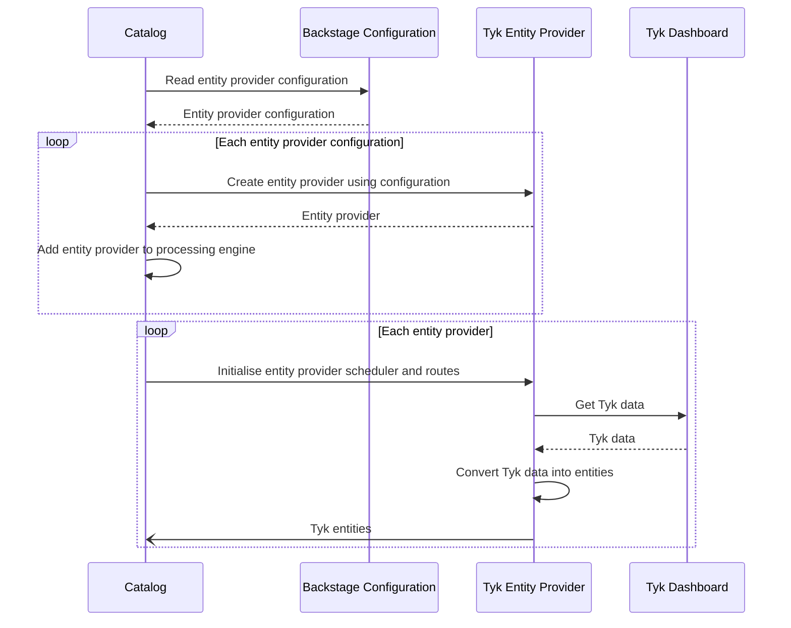
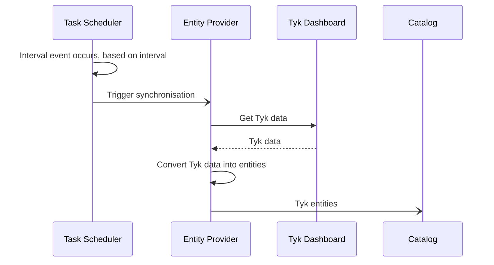
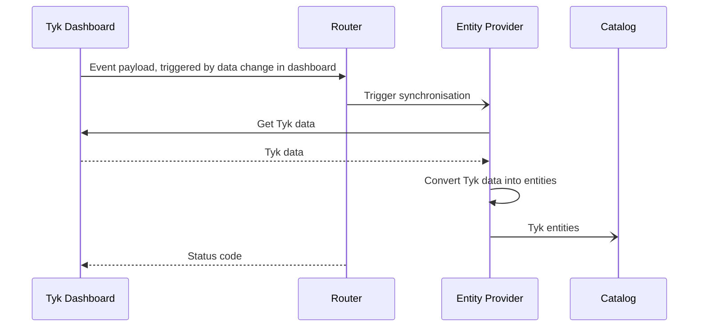

Welcome to the Tyk Backstage Entity Provider

### Sequence Diagrams

#### Entity provider initialisation

Initialisation of the entity provider by the Backstage catalog

#### Synchronisation Process

#### Operation of Scheduler

#### Operation of Router

