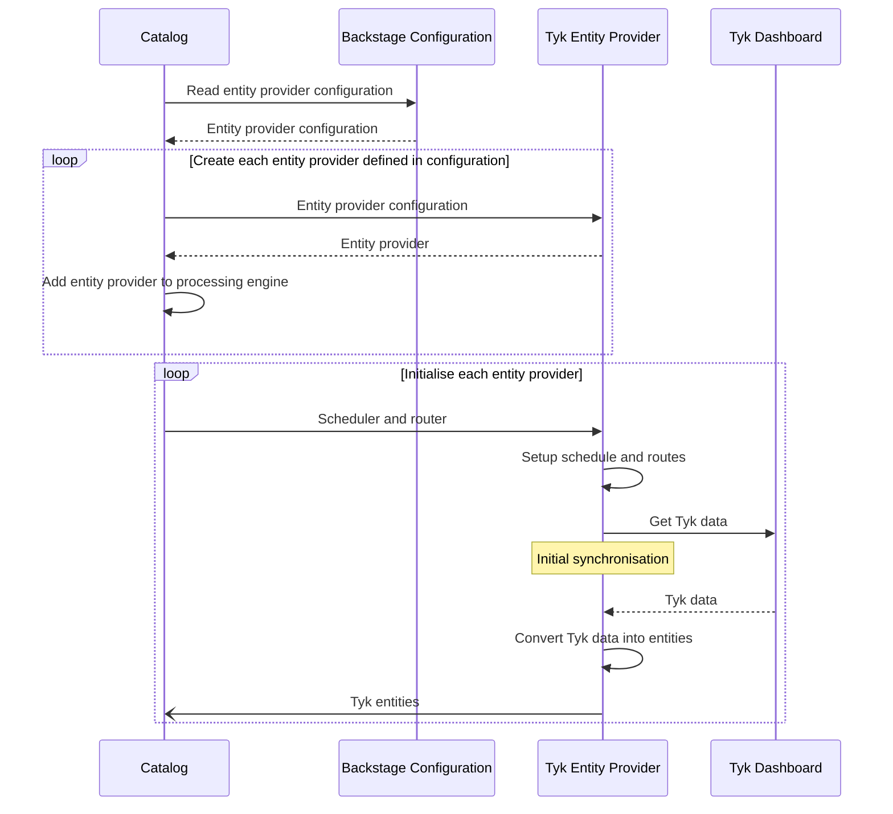
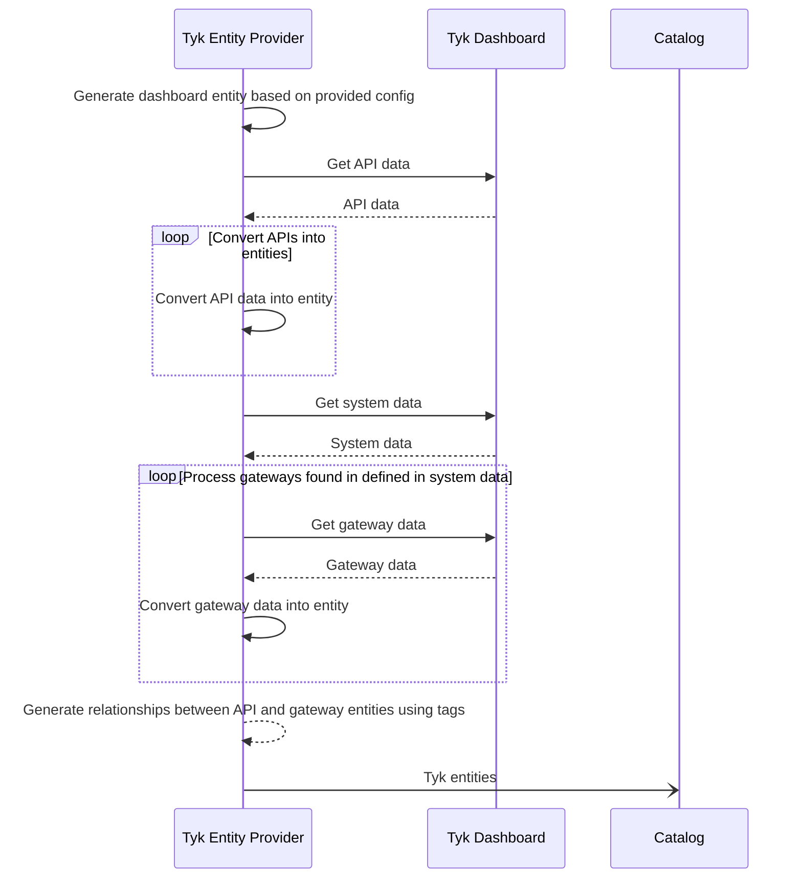

Welcome to the Tyk Backstage Entity Provider

### Sequence Diagrams

#### Entity provider initialisation

How the Backstage catalog initialises Tyk entity providers

#### Data Import Process

How the Tyk entity provider imports data from a Tyk dashboard into the Backstage catalog

#### Operation of Scheduler

How the Backstage scheduler triggers the Tyk entity provider

#### Operation of Router

How the Backstage router triggers the Tyk entity provider

