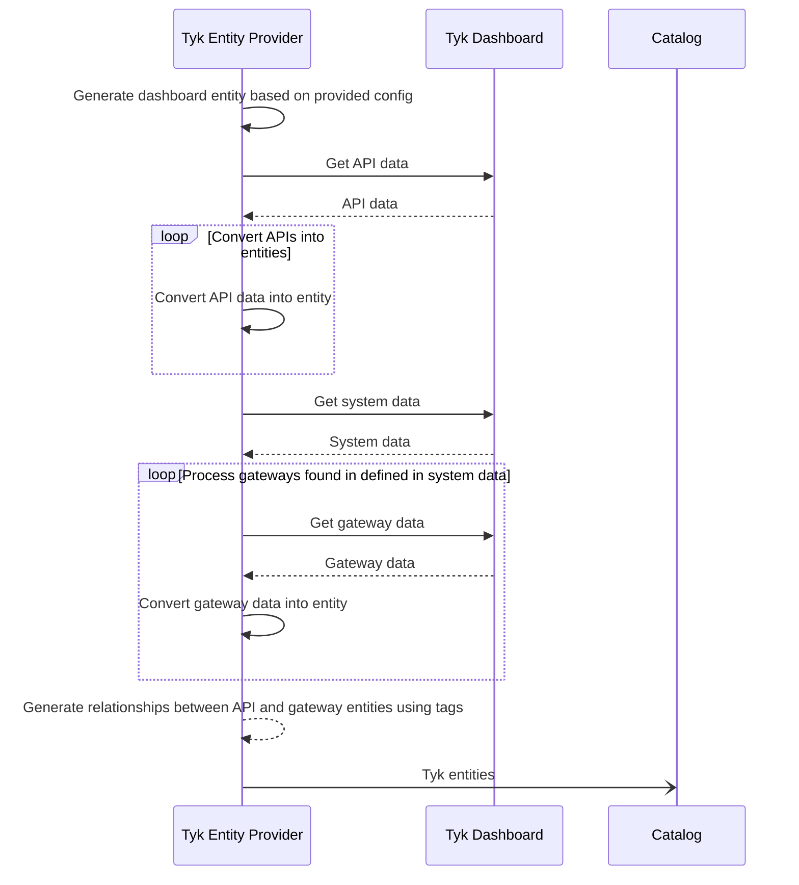
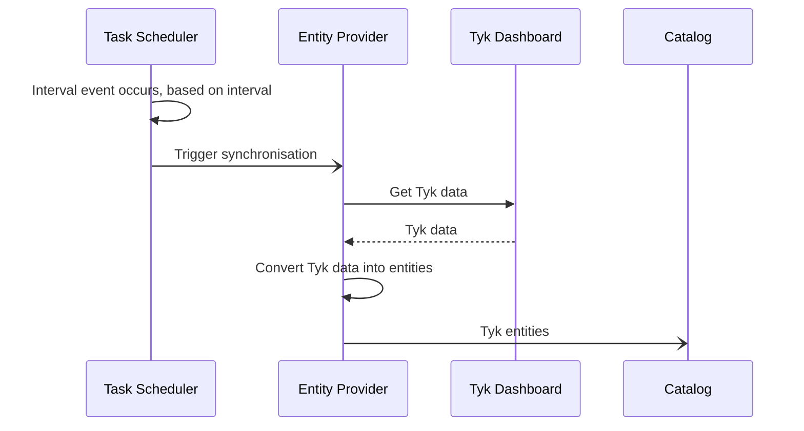
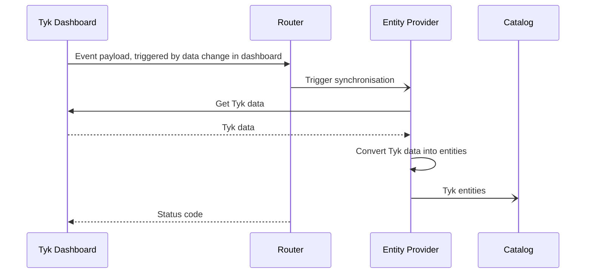

The Tyk Backstage entity provider imports Tyk API definitions and components into the Backstage catalog.

## Getting Started

### 1. Installation

To install the package, run this command from the Backstage root directory:

```
yarn --cwd packages/backend add @davegarvey/plugin-catalog-backend-module-tyk
```

### 2. Configuration

To configure the Tyk entity provider, add a `tyk` root section to the Backstage `app-config.yaml` file.

This is an example configuration: 

```
tyk:
  globalOptions:
    router:
      enabled: true
    scheduler:
      enabled: true
      frequency: 5
    importCategoriesAsTags: true
  dashboards:
    - host: http://localhost:3000
      token: ${TYKDASHBOARDAPITOKEN}
      name: development
      defaults:
        owner: group:default/guests
        system: system:default/tyk
        lifecycle: development
```

The configuration options are as follows:

Key | Purpose
---|---
`tyk` | Configuration namespace for the Tyk entity provider
`tyk.globalOptions` | Options that apply to all Tyk Dashboards registered in `tyk.dashboards`
`tyk.globalOptions.router.enabled` | If set to `true`, registers endpoints that enable the Tyk Dashboard webhooks to dynamically import Backstage entities
`tyk.globalOptions.scheduler.enabled` | If set to `true`, Adds a scheduled task to Backstage that imports Backstage entities on a regular basis
`tyk.globalOptions.scheduler.frequency` | Frequency in minutes that the scheduled task runs
`tyk.globalOptions.importCategoriesAsTags` | If set to `true`, Tyk API definition categories are imported as Backstage entity tags
`tyk.dashboards` | Array of Tyk Dashboard configurations, enabling the entity provider to import data from multiple Tyk deployments
`tyk.dashboards.host` | URL used by the entity provider to connect to the Tyk Dashboard API
`tyk.dashboards.token` | API token used by the entity provider to authenticate with the Tyk Dashboard API - must be a Tyk Dashboard API token
`tyk.dashboards.name` | Unique name by which the dashboard configuration is known by the entity provider
`tyk.dashboards.defaults` | Default Backstage values used during the import process, if no specific values are provided
`tyk.dashboards.detaults.owner` | The default Backstage owner
`tyk.dashboards.detaults.system` | The default Backstage system
`tyk.dashboards.detaults.lifecycle` | The default Backstage lifecycle


### Sequence Diagrams

#### Entity provider initialisation

How the Backstage catalog initialises Tyk entity providers

```mermaid
sequenceDiagram
    participant ca as Catalog
    participant co as Backstage Configuration
    participant ep as Tyk Entity Provider
    participant td as Tyk Dashboard
    ca->>co: Read entity provider configuration
    co-->>ca: Entity provider configuration
    loop Create each entity provider defined in configuration
        ca->>ep: Entity provider configuration
        ep-->>ca: Entity provider
        ca->>ca: Add entity provider to processing engine
    end
    loop Initialise each entity provider
        ca->>ep: Scheduler and router
        ep->>ep: Setup schedule and routes
        ep->>td: Get Tyk data
        Note over ep: Initial synchronisation
        td-->>ep: Tyk data
        ep->>ep: Convert Tyk data into entities
        ep-)ca: Tyk entities
    end
```



#### Data Import Process

How the Tyk entity provider imports data from a Tyk dashboard into the Backstage catalog



#### Operation of Scheduler

How the Backstage scheduler triggers the Tyk entity provider



#### Operation of Router

How the Backstage router triggers the Tyk entity provider


