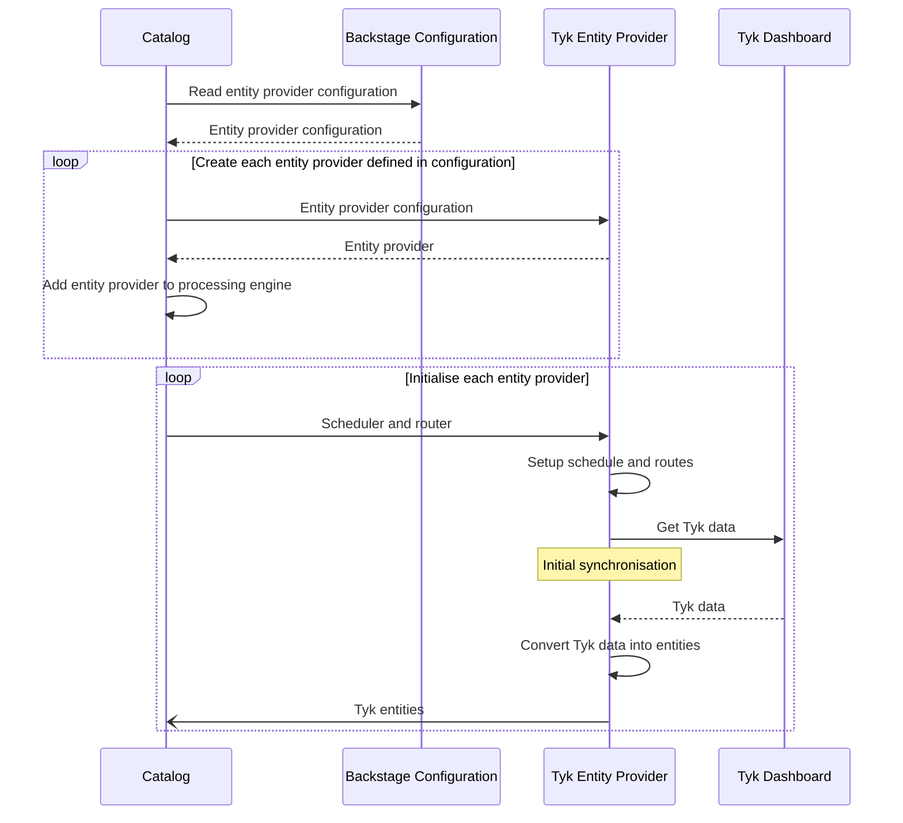
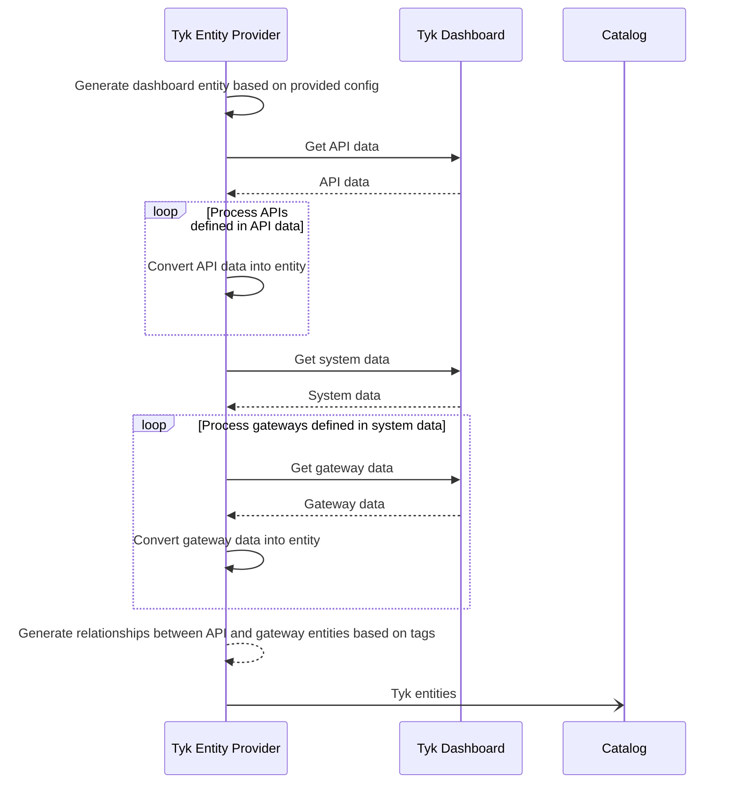
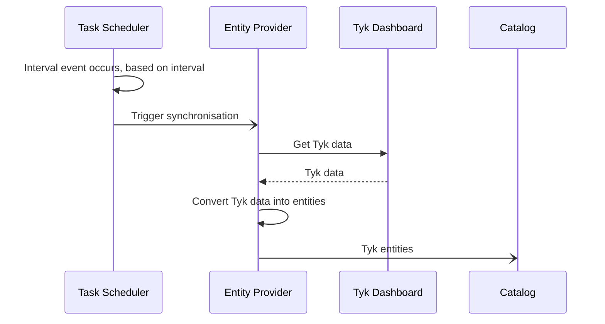
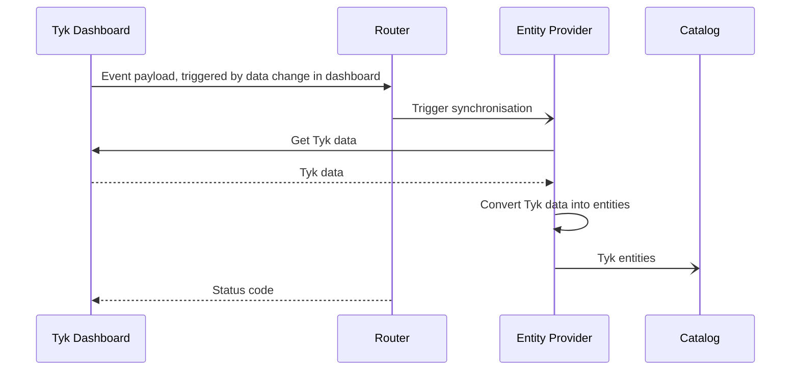

The Tyk Backstage entity provider imports Tyk API definitions and components into the Backstage catalog directly from Tyk Dashboards.

## Getting Started

### 1. Package Installation

To install the package, run this command from the Backstage root directory:

```
yarn --cwd packages/backend add @davegarvey/plugin-catalog-backend-module-tyk
```

### 2. Module Configuration

To configure the Tyk entity provider, add a `tyk` section to the root of the Backstage `app-config.yaml` file.

This is an example configuration: 

```
tyk:
  globalOptions:
    router:
      enabled: true
    scheduler:
      enabled: true
      frequency: 5
    importCategoriesAsTags: true
  dashboards:
    - host: http://localhost:3000
      token: ${TYKDASHBOARDAPITOKEN}
      name: development
      defaults:
        owner: group:default/guests
        system: system:default/tyk
        lifecycle: development
```

Note: it is possible to set configuration values using environment variables. See the use of `${TYKDASHBOARDAPITOKEN}` in the above example.

The configuration options are as follows:

Key | Purpose
---|---
`tyk` | Backstage configuration namespace for the Tyk entity provider
`tyk.globalOptions` | Options that apply to all Tyk Dashboards registered in `tyk.dashboards`
`tyk.globalOptions.router.enabled` | If set to `true`, registers endpoints that enable the Tyk Dashboard webhooks to dynamically import Backstage entities
`tyk.globalOptions.scheduler.enabled` | If set to `true`, Adds a scheduled task to Backstage that imports Backstage entities on a regular basis
`tyk.globalOptions.scheduler.frequency` | Frequency in minutes that the scheduled task runs
`tyk.globalOptions.importCategoriesAsTags` | If set to `true`, Tyk API definition categories are imported as Backstage entity tags
`tyk.dashboards` | Array of Tyk Dashboard configurations, enabling the entity provider to import data from multiple Tyk deployments
`tyk.dashboards.host` | URL used by the entity provider to connect to the Tyk Dashboard API - must include the scheme, hostname and port
`tyk.dashboards.token` | API token used by the entity provider to authenticate with the Tyk Dashboard API - must be a Tyk Dashboard API token
`tyk.dashboards.name` | Unique name by which the dashboard configuration can be identified
`tyk.dashboards.defaults` | Default Backstage values used during the import process, if no specific values are provided
`tyk.dashboards.detaults.owner` | The default Backstage owner
`tyk.dashboards.detaults.system` | The default Backstage system
`tyk.dashboards.detaults.lifecycle` | The default Backstage lifecycle

### 3. Plugin Configuration

Now that the entity provider is installed and configured, the final step is to configure the Backstage catalog to use the Tyk entity provider module. The process for this differs, depending on whether you are using the current or legacy architecture. Use of the current architecture approach is encouraged from Backstage v1.18.0 onwards.

#### Current Architecture

Follow this approach to configure the plugin for Backstage deployments using the current architecture (v1.18.0 onwards).

Add this line to the Backstage `packages/backend/src/index.ts` file:

```
backend.add(import('@davegarvey/plugin-catalog-backend-module-tyk/alpha'));
```

The line can be added anywhere in the file between the lines `const backend = createBackend();` and `backend.start();`, for example:

```
import { createBackend } from '@backstage/backend-defaults';

const backend = createBackend();

backend.add(import('@backstage/plugin-app-backend/alpha'));
backend.add(import('@backstage/plugin-proxy-backend/alpha'));
backend.add(import('@backstage/plugin-scaffolder-backend/alpha'));
backend.add(import('@backstage/plugin-techdocs-backend/alpha'));
// Tyk entity provider
backend.add(import('@davegarvey/plugin-catalog-backend-module-tyk/alpha'));

// auth plugin
backend.add(import('@backstage/plugin-auth-backend'));
// See https://backstage.io/docs/backend-system/building-backends/migrating#the-auth-plugin
backend.add(import('@backstage/plugin-auth-backend-module-guest-provider'));
// See https://github.com/backstage/backstage/blob/master/docs/auth/guest/provider.md

// catalog plugin
backend.add(import('@backstage/plugin-catalog-backend/alpha'));
backend.add(
  import('@backstage/plugin-catalog-backend-module-scaffolder-entity-model'),
);

// permission plugin
backend.add(import('@backstage/plugin-permission-backend/alpha'));
backend.add(
  import('@backstage/plugin-permission-backend-module-allow-all-policy'),
);

// search plugin
backend.add(import('@backstage/plugin-search-backend/alpha'));
backend.add(import('@backstage/plugin-search-backend-module-catalog/alpha'));
backend.add(import('@backstage/plugin-search-backend-module-techdocs/alpha'));

backend.start();
```

#### Legacy Architecture

Follow this approach to configure the plugin for Backstage deployments using the legacy architecture (prior to v1.18.0).

Several edits to the core backend catalog plugin file `packages/backend/src/plugins/catalog.ts` are required.

Follow the step-by-step process below. A fully edited example is available at the end of this section.

##### Step 1: Add the Import

Add this line to import the entity provider into the catalog plugin:

```
import { TykEntityProvider } from '@davegarvey/plugin-catalog-backend-module-tyk';
```

Put the line near the top, with the other imports.

##### Step 2: Create the Entity Providers

```
const tykEPs = TykEntityProvider.fromConfig({ config:env.config, logger:env.logger, scheduler: env.scheduler });
builder.addEntityProvider(tykEPs);
```

Put the line after `const builder: CatalogBuilder = CatalogBuilder.create(env);` but before `const {processingEngine, router} = await builder.build();`.

##### Step 3: Create Routes (Optional)

This step is only necessary is the router functionality is enabled i.e. `tyk.globalOptions.router.enabled` is set to `true`. In this case, add the following lines to register the routes:

```
await Promise.all(tykEPs.map(async (ep) => {
  await ep.registerRoutes(router);
}));
```

Put the lines after `await processingEngine.start();` but before `return router;`.

##### Full Example

This example shows a fully edited `packages/backend/src/plugins/catalog.ts` file, with the three steps marked with comments `Step 1`, `Step 2` and `Step 3`:

```
import {CatalogBuilder} from '@backstage/plugin-catalog-backend';
import {ScaffolderEntitiesProcessor} from '@backstage/plugin-scaffolder-backend';
import {Router} from 'express';
import {PluginEnvironment} from '../types';
// Step 1
import { TykEntityProvider } from '@davegarvey/plugin-catalog-backend-module-tyk';

export default async function createPlugin(
  env: PluginEnvironment,
): Promise<Router> {
  const builder: CatalogBuilder = CatalogBuilder.create(env);
  builder.addProcessor(new ScaffolderEntitiesProcessor());

  // Step 2
  const tykEPs = TykEntityProvider.fromConfig({ config:env.config, logger:env.logger, scheduler: env.scheduler });
  builder.addEntityProvider(tykEPs);  

  const {processingEngine, router} = await builder.build();
  await processingEngine.start();

  // Step 3
  await Promise.all(tykEPs.map(async (ep) => {
    await ep.registerRoutes(router);
  }));

  return router;
}
```

### 4. Validate Functionality

If the entity provider module is successfully installed and configured, you will see entries in the Backstage backend application logs.

On startup, the entity provider logs initialisation success:

```
2024-04-08T09:08:44.125Z catalog info Tyk entity provider initialized for development Dashboard
```

On data import, the entity provider logs the quantity of entities imported:

```
2024-04-08T09:08:45.315Z catalog info Importing 44 Tyk entities from development Dashboard entityProvider=tyk-entity-provider-development
```

For entity provider configurations that contain multiple Tyk dashboards, there will be equivilent multiple log entries. To distinguish them from each other, the name of the Tyk dashboard configuraion is provided - in these examples it is `development`.

## Troubleshooting

If the entity provider encounters a problem it will log warnings and errors in the Backstage backend application log.

To increase the logging verbosity, the set the log level to `debug`. For example, using yarn:

```
LOG_LEVEL=debug yarn start-backend
```

Setting `LOG_LEVEL` to `debug` won't display additional warning or error messages, as these are normally always displayed. Nevertheless, the additional debug information may be useful in troubleshooting.

## Sequence Diagrams

### Entity Provider Initialisation

How the Backstage catalog initialises Tyk entity providers



### Data Import Process

How the Tyk entity provider imports data from a Tyk dashboard into the Backstage catalog



### Operation of Schedule-Based Data Import

How the Backstage scheduler triggers the Tyk entity provider



### Operation of Router-Based Data Import

How the Backstage router triggers the Tyk entity provider


