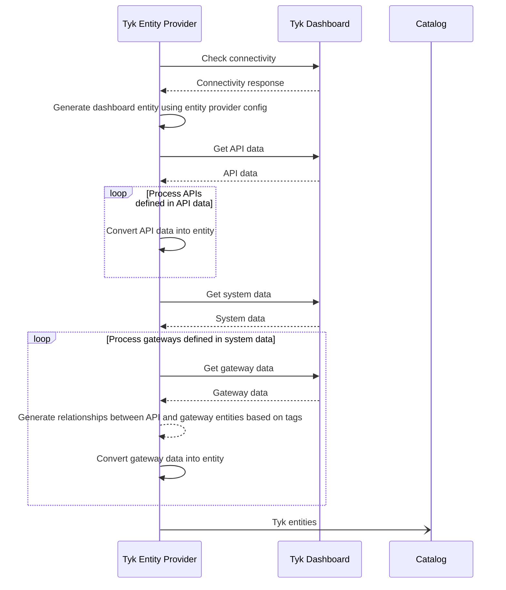

The Tyk Backstage entity provider imports Tyk API definitions and components into the Backstage catalog directly from Tyk Dashboards.

## Getting Started

To use the entity provider, you will need:
- An active Tyk installation with a valid dashboard API token
- A Backstage application (v1.18.0 or later recommended)

### 1. Package Installation

The Tyk Backstage Plugin is available as a public NPM package. To install it, run this command from the Backstage root directory:

```shell
yarn --cwd packages/backend add @tyk-technologies/plugin-catalog-backend-module-tyk
```

### 2. Module Configuration

To configure the entity provider, add a `tyk` section to the root of the Backstage `app-config.yaml` file.

This is an example configuration: 

```yaml
tyk:
  globalOptions:
    router:
      enabled: true
    scheduler:
      enabled: true
      frequency: 5
    importCategoriesAsTags: true
  dashboards:
    - host: http://localhost:3000
      token: ${TYKDASHBOARDAPITOKEN}
      name: development
      defaults:
        owner: group:default/guests
        system: system:default/tyk
        lifecycle: development
```

This example configuration:
- Enables both the router and scheduler data import methods
- Sets the scheduler import to run every `5` minutes
- Enables Tyk API definition categories to be imported as Backstage entity tags
- Defines one Tyk dashboard named `development` from which to import data:
  - Dashboard is accessible on `http://localhost:3000`
  - Environment variable `TYKDASHBOARDAPITOKEN` set as the Dashboard API access token
  - Backstage metadata default values set to `group:default/guests`, `system:default/tyk` and `development`

#### Configuration Description

Key | Purpose
---|---
`tyk` | Backstage configuration namespace for the Tyk entity provider
`tyk.globalOptions` | Options that apply to all Tyk Dashboards registered in `tyk.dashboards`
`tyk.globalOptions.router.enabled` | If set to `true`, registers endpoints that enable the Tyk Dashboard webhooks to dynamically import Backstage entities
`tyk.globalOptions.scheduler.enabled` | If set to `true`, adds a scheduled task to Backstage that imports Backstage entities on a regular basis
`tyk.globalOptions.scheduler.frequency` | Frequency in minutes that the scheduled task runs
`tyk.globalOptions.importCategoriesAsTags` | If set to `true`, Tyk API definition categories are imported as Backstage entity tags
`tyk.dashboards` | Array of Tyk Dashboard configurations, enabling the entity provider to import data from multiple Tyk deployments
`tyk.dashboards.host` | URL used by the entity provider to connect to the Tyk Dashboard API - must include the scheme, hostname and port
`tyk.dashboards.token` | API token used by the entity provider to authenticate with the Tyk Dashboard API - must be a Tyk Dashboard API token
`tyk.dashboards.name` | Unique name by which the dashboard configuration can be identified
`tyk.dashboards.defaults` | Default Backstage values used during the import process, if no specific values are provided
`tyk.dashboards.defaults.owner` | The default Backstage owner
`tyk.dashboards.defaults.system` | The default Backstage system
`tyk.dashboards.defaults.lifecycle` | The default Backstage lifecycle

Note: Either one or both of the `router` or `scheduler` must be enabled.

### 3. Plugin Configuration

Now that the entity provider is installed and configured, the next step is to configure Backstage to use it. The process for this differs, depending on whether you are using Backstage's *current* or *legacy* architecture. Use of the current architecture approach is encouraged from Backstage v1.18.0 onwards.

#### Current Architecture (Backstage v1.18.0 onwards)

Follow this approach to configure the plugin for Backstage deployments using the current architecture.

Add this line to the Backstage `packages/backend/src/index.ts` file:

```ts
backend.add(import('@tyk-technologies/plugin-catalog-backend-module-tyk/alpha'));
```

The line can be added anywhere in the file between the lines `const backend = createBackend();` and `backend.start();`, for example:

```ts
import { createBackend } from '@backstage/backend-defaults';

const backend = createBackend();

backend.add(import('@backstage/plugin-app-backend/alpha'));
backend.add(import('@backstage/plugin-proxy-backend/alpha'));
backend.add(import('@backstage/plugin-scaffolder-backend/alpha'));
backend.add(import('@backstage/plugin-techdocs-backend/alpha'));
// Tyk entity provider
backend.add(import('@tyk-technologies/plugin-catalog-backend-module-tyk/alpha'));

// auth plugin
backend.add(import('@backstage/plugin-auth-backend'));
// See https://backstage.io/docs/backend-system/building-backends/migrating#the-auth-plugin
backend.add(import('@backstage/plugin-auth-backend-module-guest-provider'));
// See https://github.com/backstage/backstage/blob/master/docs/auth/guest/provider.md

// catalog plugin
backend.add(import('@backstage/plugin-catalog-backend/alpha'));
backend.add(
  import('@backstage/plugin-catalog-backend-module-scaffolder-entity-model'),
);

// permission plugin
backend.add(import('@backstage/plugin-permission-backend/alpha'));
backend.add(
  import('@backstage/plugin-permission-backend-module-allow-all-policy'),
);

// search plugin
backend.add(import('@backstage/plugin-search-backend/alpha'));
backend.add(import('@backstage/plugin-search-backend-module-catalog/alpha'));
backend.add(import('@backstage/plugin-search-backend-module-techdocs/alpha'));

backend.start();
```

You can now skip the next section and move onto **Configure Tyk Webhook (Optional)**.

#### Legacy Architecture (prior to Backstage v1.18.0)

Follow this approach to configure the plugin for Backstage deployments using the legacy architecture.

Several edits are required to the core backend catalog plugin file `packages/backend/src/plugins/catalog.ts`.

Follow the step-by-step process below. A fully edited example is available at the end of this section.

##### Step 1: Add the Import

Add this line to import the entity provider into the catalog plugin:

```ts
import { TykEntityProvider } from '@tyk-technologies/plugin-catalog-backend-module-tyk';
```

Put the line near the top, with the other imports.

##### Step 2: Create the Entity Providers

Add these lines to create the entity providers and add them to the catalog builder:

```ts
const tykEPs = TykEntityProvider.fromConfig({ config:env.config, logger:env.logger, scheduler: env.scheduler });
builder.addEntityProvider(tykEPs);
```

Put the lines after `const builder: CatalogBuilder = CatalogBuilder.create(env);` but before `const {processingEngine, router} = await builder.build();`.

##### Step 3: Create Routes (Optional)

This step is only necessary if the router functionality is enabled i.e. `tyk.globalOptions.router.enabled` is set to `true`. 

Add these lines to register the routes:

```ts
await Promise.all(tykEPs.map(async (ep) => {
  await ep.registerRoutes(router);
}));
```

Put the lines after `await processingEngine.start();` but before `return router;`.

##### Full Example

This example shows a fully edited `packages/backend/src/plugins/catalog.ts` file, with the three steps marked with comments `Step 1`, `Step 2` and `Step 3`:

```ts
import {CatalogBuilder} from '@backstage/plugin-catalog-backend';
import {ScaffolderEntitiesProcessor} from '@backstage/plugin-scaffolder-backend';
import {Router} from 'express';
import {PluginEnvironment} from '../types';
// Step 1
import { TykEntityProvider } from '@tyk-technologies/plugin-catalog-backend-module-tyk';

export default async function createPlugin(
  env: PluginEnvironment,
): Promise<Router> {
  const builder: CatalogBuilder = CatalogBuilder.create(env);
  builder.addProcessor(new ScaffolderEntitiesProcessor());

  // Step 2
  const tykEPs = TykEntityProvider.fromConfig({ config:env.config, logger:env.logger, scheduler: env.scheduler });
  builder.addEntityProvider(tykEPs);  

  const {processingEngine, router} = await builder.build();
  await processingEngine.start();

  // Step 3
  await Promise.all(tykEPs.map(async (ep) => {
    await ep.registerRoutes(router);
  }));

  return router;
}
```

### 4. Configure Tyk Webhook (Optional)

This step is only required if `router` is enabled.

The Tyk Dashboard must make a webhook request to trigger Backstage to perform router-based synchronisation. To do this, the Tyk *organisation* object needs to be updated to generate API events.

Update your Tyk organisation JSON object via the [Dashboard Admin API](https://tyk.io/docs/dashboard-admin-api/). In the organisation JSON, add an `api_event` object to the `event_options` section. For example, this shows a simple organisation JSON that contains an `api_event` with a Backstage URL:

```json
{
  "id": "5e9d9544a1dcd60001d0ed20",
  "owner_name": "Tyk Demo",
  "apis": [],
  "event_options": {
    "api_event": {
      "webhook": "http://my-backstage-backend:7007/api/catalog/tyk/development/sync"
    }
  }
}
```

Note:
- The `webhook` Backstage URL must resolve to the Backstage backend from the Tyk Dashboard
- The path used for the `webhook` Backstage URL must be in the form `/api/catalog/tyk/{dashboard_config_name}/sync`, where `{dashboard_config_name}` is the `name` of the Backstage dashboard config. In this example, it is `development`.

### 5. Validate Functionality

If the entity provider module is successfully installed and configured, you will see entries in the Backstage backend application logs related to initialisation and entity import.

#### Initialisation

On startup, the entity provider logs that it has been initialised:

```shell
2024-04-08T09:08:44.125Z catalog info Tyk entity provider initialized for development Dashboard
```

#### Entity Import

On data import, the entity provider specifies how many entities were imported and where they were imported from:

```shell
2024-04-08T09:08:45.315Z catalog info Importing 44 Tyk entities from development Dashboard entityProvider=tyk-entity-provider-development
```

#### Dynamic Synchronisation

This only applies if router-based synchronisation is enabled.

On data change in the Tyk Dashboard, the router records the incoming HTTP request from the dashboard:

```shell
2024-04-09T15:24:00.581Z backstage info ::ffff:127.0.0.1 - - [09/Apr/2024:15:24:00 +0000] "POST /api/catalog/tyk/development/sync HTTP/1.1" 200 - "-" "Tyk-Dash-Hookshot" type=incomingRequest
```

There will also be a log message related to importing entities, as per **Entity Import** above.

## Multi-Dashboard Configuration

It's possible to target multiple Tyk Dashboards in the entity provider configuration. To do this, specify multiple dashboards in the `tyk.dashboards` section of the Backstage configuration. 

For example, this configuration defines two dashboards, `development` and `production`:

```yaml
tyk:
  dashboards:
    - name: development
      host: http://tyk-dashboard.dev:3000
      token: ${TYKDASHBOARDAPITOKENDEV}
      defaults:
        owner: group:default/guests
        system: system:default/tyk
        lifecycle: development
    - name: production
      host: http://tyk-dashboard.prod:3000
      token: ${TYKDASHBOARDAPITOKENPROD}
      defaults:
        owner: group:default/guests
        system: system:default/tyk
        lifecycle: production
```

Note: For brevity, the `globalOptions` section is omitted from the above configuration.

## Data Import Process

The data is imported directly from Tyk into Backstage via the Dashboard API, where the Tyk object fields and relationships are mapped to Backstage entities.

The entity provider imports the follow Tyk data:
- API Definitions
- Dashboards
- Gateways

### Data Import Sequence Diagram

This is a overview of the data import process.



### Synchronisation Methods

There are two methods for triggering synchronisation, schedule-based and router-based. Either or both of these methods can be chosen - see the **Module Configuration** section for more information.

#### Scheduler-Based Synchronisation

Scheduler-based synchronisation is a simple method that uses a scheduled task to pull data from a Tyk dashboard on regular intervals. 

The advantages of this approach are that it's quick and easy to set up. It doesn't require any additional configuration of the Tyk system in order to function.

The disadvantage is the rigid nature of the scheduled task, which means that there's a delay in Tyk data updates reaching Backstage. It also means that synchronisations are performed whether needed or not.

#### Router-Based Synchronisation

Router-based synchronisation can be seen as more efficient when compared to the scheduler approach. Rather than operating on a regular interval, it instead waits for synchronisation to be triggered remotely.

The advantage of this approach is that it allows Tyk to initiate the synchronisation process when changes occur in the dashboard. 

The disadvantage is that the Tyk dashboard must be configured to send webhook requests when data changes occur - see the **Tyk Dashboard Organisation Configuration** section for more information. This is additional effort when compared to the scheduler approach.

##### Endpoint Paths

The endpoint paths created for the router-based approach are based on the `name` of the Dashboard in the Backstage configuration, for example:

```
/api/catalog/tyk/development/sync
```

In this example, `development` is the `name` given to the Dashboard in the Backstage configuration. Since the `name` is unique, each dashboard configuration is assigned its own endpoint. The `name` is the only part of the path to change, the rest remains the same across all dashboard configurations.

### Entity Relationships

Entity relationships are established automatically, based on the known connections between Tyk components and data. For example, the Tyk Dashboard provides several APIs, but consumes the API provided by the Tyk Gateway, so has a dependency on that component.

The entity provider establishes relationships between entities using common Backstage relation types:
- `providesApis`
- `consumesApis`
- `dependsOn`
- `subcomponentOf`

The relationship between APIs and Gateways depends on whether the Gateway is segmented. In this scenario, Gateways only provide APIs that have a matching segmentation tag. The entity provider is aware of this and sets the `providesApis` relationship accordingly.

### Non-Tyk Entities

The entity provider does not handle management of non-Tyk entities, such as **systems** and **owners**. Tyk entities will refer to these as part of their Backstage metadata. 

These entities should be defined and imported separately, such as through a static YAML file. For example, this is an example of a `System` entity:

```yaml
# https://backstage.io/docs/features/software-catalog/descriptor-format#kind-system
apiVersion: backstage.io/v1alpha1
kind: System
metadata:
  name: tyk
  description: Tyk API Management
spec:
  owner: guests
```

This yaml file can then be referenced from `catalog.locations` section of the Backstage `app-config.yaml` file:

```yaml
catalog:
  locations:
    # Basic Tyk catalog items that do not come from the import process, including the 'tyk' system
    - type: file
      target: tyk-catalog.yaml
```

Missing entities will not prevent Tyk data from being imported into Backstage, but it may provide an unsatisfactory user experience as Backstage users can encounter 'entity not found' errors through the Backstage user interface.

### Statically Defined Tyk Entities

Some Tyk components can't be automatically imported, as they're not discoverable through the Dashboard API. In these situations a static YAML file can be used to define the entity. For example, a Tyk Pump entity could be defined as follows:

```yaml
# https://backstage.io/docs/features/software-catalog/descriptor-format#kind-component
apiVersion: backstage.io/v1alpha1
kind: Component
metadata:
  name: tyk-pump-development
  title: Tyk Pump
spec:
  type: service
  lifecycle: development
  owner: guests
  system: tyk
  subcomponentOf: tyk-dashboard-development
```

#### Predictable Entity Naming

Establishing relationships between statically and dynamically imported entities is made possible by use of predictable naming.

Where possible, predictable names are used for dynamically imported entities. Name formats differ between different types of object, but they will typically contain:
- Name of the dashboard configuration from which the entity was imported
- Unique id of the Tyk object

For example, an API entity with the name `development-727dad853a8a45f64ab981154d1ffdad` is a combination of:
- `development`: the dashboard configuration name
- `727dad853a8a45f64ab981154d1ffdad`: the unique id of the object in Tyk

The name of this entity will be consistent across mulitple imports.

### Labels

The entity provider automatically adds labels to API entities during the import process. These labels are based on values from the source API definition:

Backstage Label | Source API Definition Field | Source Type | Description
---|---|---|---
`tyk.io/active` | `active` | Boolean | Active status of the API definition
`tyk.io/apiId` | `api_id` | GUID | Unique id of the API definition
`tyk.io/name` | `name` | String | Name of the API definition, converted to "kebab-case" to comply with label rules
`tyk.io/authentication` | n/a | n/a | Authentication mechanism of the API definition

All labels are prefixed `tyk.io/` to distinguish them from labels added from other sources.

#### Custom Labels

Custom labels can be added to API entities by including a `labels` array within the `backstage` object in the Tyk API Definition `config_data` field. The `labels` array should contain key/value pair objects that represent the labels. For example:

```json
{
  "backstage": {
    "labels": [
      { 
        "key": "hello",
        "value": "world"
      }
    ]
  }
}
```

In this example, a label called `tyk.io/hello` with the value `world` will be added to the imported API entity.

### Tags

The entity provider can automatically create tags for API entities using the categories defined in source Tyk API definitions.

This functionality is controlled by the `tyk.globalOptions.importCategoriesAsTags` configuration option, which if set to `true` will perform the conversion. Entity tags are created with the `#` Tyk category prefix.

### Annotations

The entity provider automatically creates annotations for API entities. The annotations are based on the Backstage "well-known" annotations:

Annotation | Value
---|---
`backstage.io/managed-by-location` | URL of the source Tyk Dashboard
`backstage.io/managed-by-origin-location` | URL of the source Tyk Dashboard
`backstage.io/edit-url` | URL of the source API definition entity in the Tyk Dashboard
`backstage.io/view-url` | URL of the source API definition entity in the Tyk Dashboard
`backstage.io/source-location` | URL of the source API definition entity in the Tyk Dashboard

Setting these annotations allows Backstage to provide additional functionality, such as displaying contextual links when listing API objects in the Backstage user interface.

### Metadata Overrides

When importing data, the entity provider applies default values for the Backstage metadata fields `lifecycle`, `owner`, and `system`. These defaults are defined per `dashboard` in the entity provider configuration and apply to all entities imported using that dashboard configuration.

To override these defaults, specify custom values in the `config_data` field of the Tyk API definition:

```json
{
  "backstage": {
    "lifecycle:": "my lifecycle",
    "owner": "my owner",
    "system": "my system"
  }
}
```

These fields must be placed inside a `backstage` object. They are optional - if any field is omitted, the corresponding default value will be used.

### API Specification

The entity provider automatically sets the API specification type depending on the type of API being imported:

Tyk API Type | Backstage API Specification Type
---|---
Standard Tyk API Definition | `tyk`
OAS | `openapi`
GraphQL | `graphql`

When a specification type is set to `openapi` or `graphql`, Backstage renders the relevant user interface for the specification document e.g. GraphiQL is used for GraphQL APIs. The `tyk` specification type does not have a user interface, so is displayed as JSON.

## Troubleshooting

If the entity provider encounters a problem it will log warnings and errors in the Backstage backend application log.

To increase the logging verbosity, set the log level to `debug`. For example, using yarn:

```shell
LOG_LEVEL=debug yarn start-backend
```

Setting `LOG_LEVEL` to `debug` won't display additional information related to warnings or errors, as this is typically already displayed. Nevertheless, the additional debug information may be useful for troubleshooting.
